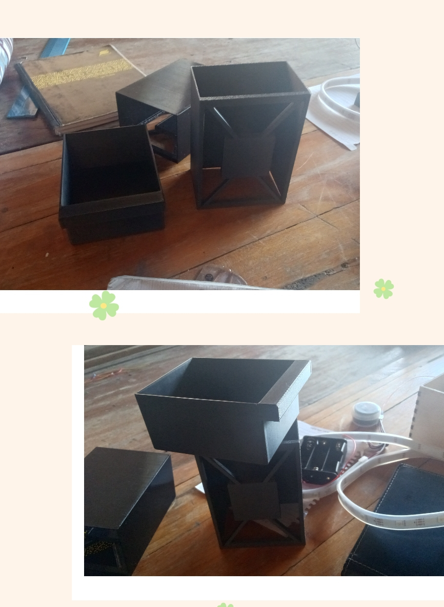

# Journal du Jeudi, le 10 Septembre 2026 (rédigé par: Kokou MEGNASSAN)

## Fait aujourd'hui

- Mise en place 
- Information sur le programme du jour :  
> **Avancement du Projet P 150 : Groupe 15**  
> *1-Dimensionnement du tiroir et de l'Armoire*  
> *2-Impression du Tiroir et de l'Armoire sur l'imprimante 3D*  
> *3- Recherche des composants sur le Logiciel Kicad*

## Appris
- **1- Modélisation du Tiroir et de l'Armoire**
> *-L'Armoire de chaque casier doit avoir un endroit centré où doit se poser le capteur FSR402*  

> *-Le tiroir doit être conforme à l'Armoire afin de respecter les dimensions de ce dernier*

- **2- Les Composants en PCB sur Kicad**
> *-Certains composants électroniques n'ont pas leur forme intégrale sur Kicad*

> *-Il est important de Schematiser le Circuit avant de passer au PCB; ce qui nous une idée claire pour la réalisation du PCB*

## Raté, puis corrigé

- Le tiroir et l'armoire ne sont pas conforme ; l'armoire est plus gros que le tiroir 

## Décidé
- Prendre les dimensions d'un casier un peu petit en tenant compte du rôle de FSR402 : Longueur = 100mm; Largeur = 85mm  et Hauteur = 62mm
- Concevoir un Boîtier pour faire les câbles et les composants interconnectés sur le même PCB
- Tous les composants doivent pas rester sur le même PCB

## À faire demain
- Remodéliser l'Armoire et le Tiroir tout en respectant les dimensions respectées
- Schématiser le circuit electronique sur Kicad
